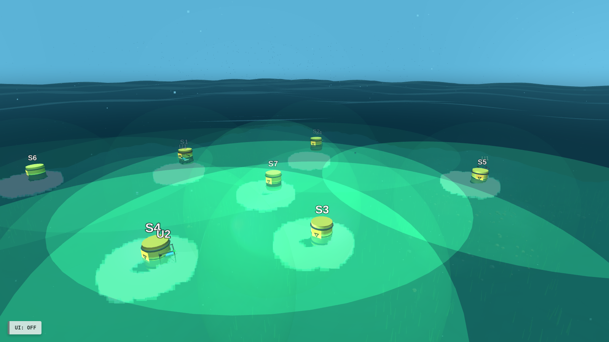
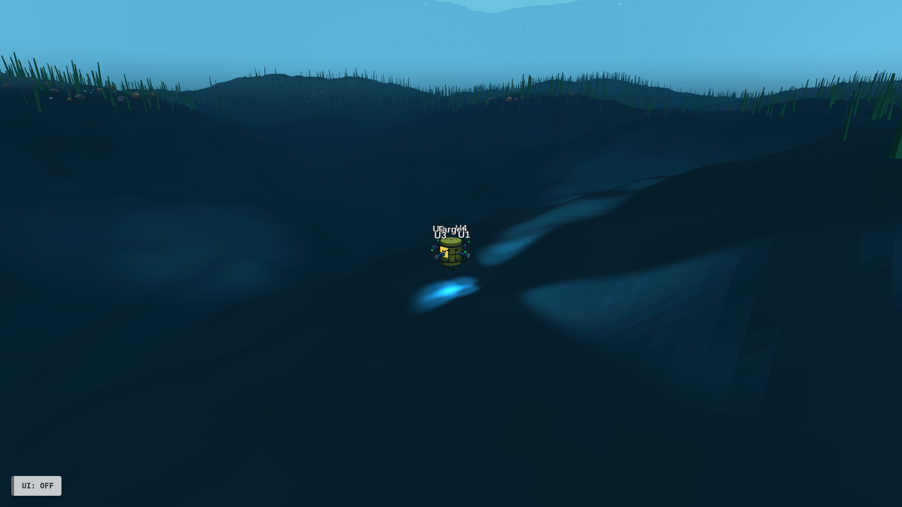
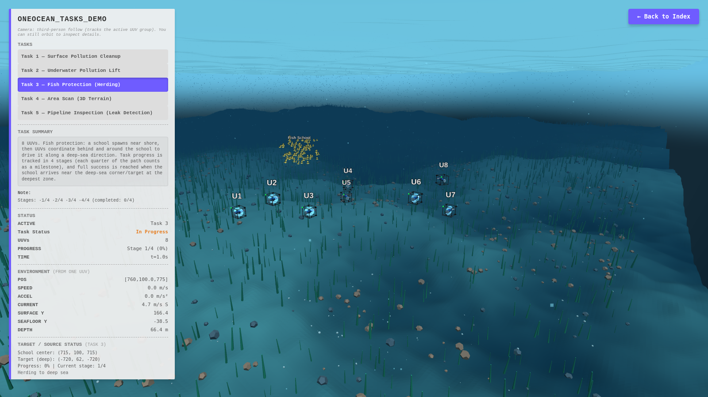
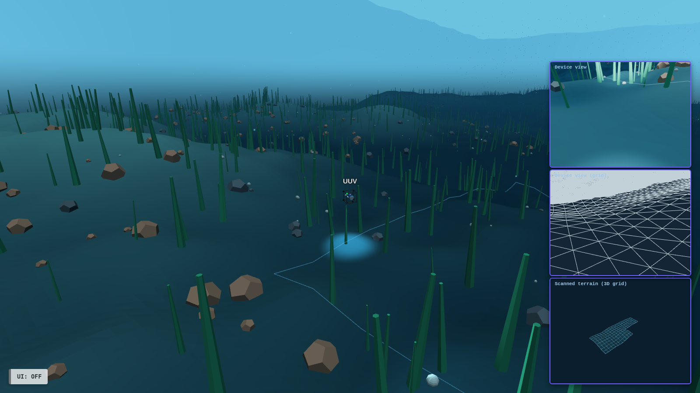
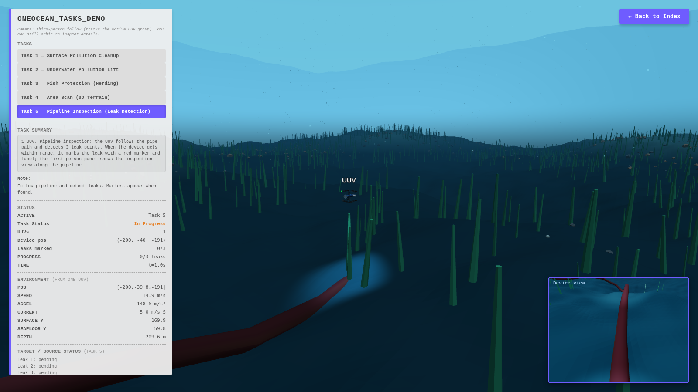
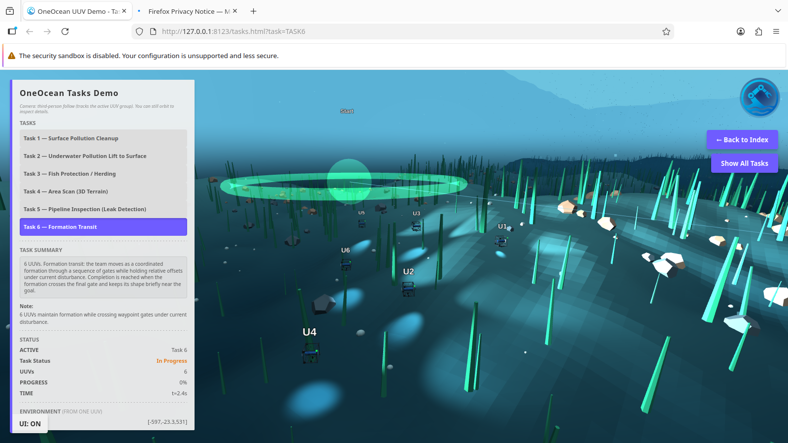

# OneOcean UUV Online Demo

This folder provides a lightweight, GitHub Pages–friendly underwater web demo with:

- `index.html`: interactive environment page (UUV control + currents + pollutant targets)
- `tasks.html`: task demo page (button switch + third-person follow camera)
- `example/`: screenshots for `index.html` and `tasks.html`

## Task Demos (tasks.html)

`tasks.html` showcases six representative tasks in the same ocean environment style as `index.html`:

1. **Task 1 — Surface Pollution Cleanup (Multi-UUV)**
   - Surface pollution sources are visualized as yellow barrels with visible diffusion.
   - Multiple UUVs approach from different directions; each UUV neutralizes one source at a time with a visible purifier effect.
   - After neutralization, diffusion stops and the source changes color; UUVs continue until all sources are cleaned.
   
   

2. **Task 2 — Underwater Pollution Lift to Surface (5 UUVs)**
   - A barrel near the seabed is attached by four UUVs from front/back/left/right and lifted away from terrain relief.
   - After staying off-terrain briefly, a fifth UUV attaches from below and the team carries the barrel upward to the surface.
   
   

3. **Task 3 — Fish Protection / Herding (8 UUVs)**
   - A fish school spawns near shore; eight UUVs coordinate to herd the school toward a deep-sea target region.
   - Progress is tracked in 4 stages (each quarter of the path is a milestone); reaching the deep-sea corner/target counts as full success.
   
   

4. **Task 4 — Area Scan (3D Terrain)**
   - One UUV performs a lawn-mower scan over a bounded area and marks scanned cells.
   - A live 3D terrain grid preview is reconstructed from the scanned cells.
   
   

5. **Task 5 — Pipeline Inspection (Leak Detection)**
   - One UUV follows a pipeline path and detects three leak points along the route.
   - When a leak is detected, it is marked with a red marker/label; the device view panel shows the inspection camera.
   
   

6. **Task 6 — Formation Transit (6 UUVs)**
   - Six UUVs move as a coordinated formation through a sequence of gates while maintaining relative offsets under current disturbance.
   - Passed waypoints change color to show progress; completion is reached when the formation crosses the final gate and holds shape briefly near the goal.
   
   
